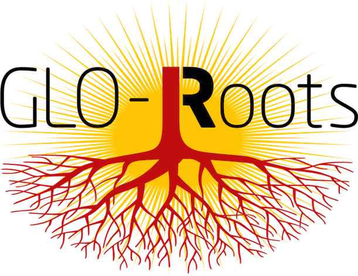

## GLO-Roots project

Growth and Luminescence Observatory for Roots (GLO-Roots) is a root imaging platform to study
root system architecture and gene expression of plants growing in soil.

## Multidimensional mapping of root responses to environmental cues using a luminescence-based imaging system  
Rubén Rellán-Álvarez1, 9, Guillaume Lobet2, Heike Lindner1, 8, Pierre-Luc Pradier1, 8, 10, Muh-Ching Yee1, Jose Sebastian1, Yu Geng1, 7, Charlotte Trontin1, Therese LaRue3, Amanda Schrager4, Cara Haney5, Rita Nieu6, Julin Maloof4, John P. Vogel7, José R. Dinneny1,12 

Preprint - BioRxiv 03-30-2015 [http://dx.doi.org/10.1101/016931](http://biorxiv.org/content/early/2015/03/30/016931)

## Abstract

Root systems develop different root types that individually sense cues from their local environment and integrate this with systemic signals. This complex multi-dimensional amalgam of inputs leads to continuous adjustment of root growth rates, direction and metabolic activity to define a dynamic physical network. Current methods for analyzing root biology balance physiological relevance with imaging capability. To bridge this divide, we developed an integrated imaging system called Growth and Luminescence Observatory for Roots (GLO-Roots) that uses luminescence-based reporters to enable studies of root architecture and gene expression patterns in soil-grown, light-shielded roots. We have developed image analysis algorithms that allow the spatial integration of soil properties such as soil moisture with root traits. We propose GLO-Roots as a system that has great utility in both presenting environmental stimuli to roots in ways that evoke natural adaptive responses, and in providing tools for developing a multi-dimensional understanding of such processes.

1 Department of Plant Biology, Carnegie Institution for Science, Stanford, CA, USA.

2 PhytoSystems, University of Liège, Liège, Belgium.

3 Department of Biology, Stanford University, Stanford, CA, USA.

4 Department of Plant Biology, UC Davis, Davis, CA, USA.

5 Harvard Medical School/Massachusetts General Hospital, Department of Genetics/Department of Molecular Biology Boston, MA, USA

6 USDA Western Regional Research Center, Albany, CA, USA

7 DOE Joint Genome Institute, Walnut Creek, CA, USA

8 These authors contributed equally

9 Present address: Unidad de Genómica Avanzada (Langebio), CINVESTAV, Irapuato, México.

10 Present address: Boyce Thompson Institute for Plant Research/USDA, Ithaca, NY, USA.

11 Present address: Energy Biosciences Institute, UC, Berkeley, CA, USA

12 Corresponding author

<!---
your comment goes here
and here
-->
