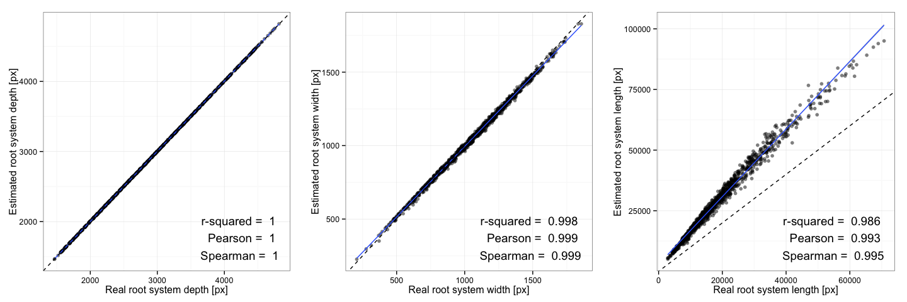

# Validation of GLO-RIA
Rubén Rellán-Álvarez, Guillaume Lobet, Heike Lindner, Pierre-Luc Pradier, Jose Sebastian1, Muh-Ching Yee, Yu Geng, Charlotte Trontin, Therese LaRue, Amanda Schrager, Cara Haney, Rita Nieu, Julin Maloof, John P. Vogel, José R. Dinneny  
17 Jul 2015  

This document presents the validation of different GLO-RIA measurments. Twoa pproaches were chosen for the validation. First, we compared some of the measurements from GLO-RIA with manual ones (for the directionality). Second, we used the ArchiSimple model (Pagès et al. 2013) to generated images of root systems. Since the images are created using a model, we know the ground-truth values for each of them. This allows us to validate GLORIA on a large number of ground-truth images.

# Size related measurements

 

For the validation of size variables, we used Archisimple to generate 1050 root systems with contrasted size. We compared the results from GLO-RIA with the ground-truth values from the model.

 

# Directionality

For the validation of directionality measurements, we used Archisimple to generate 1050 root systems with contrasted gravitropism. We compared the results from GLO-RIA with the ground-truth values from the model.

 

# References 

Pagès, L., Bécel, C., Boukcim, H., Moreau, D., Nguyen, C., & Voisin, A.-S. (2013). Calibration and evaluation of ArchiSimple, a simple model of root system architecture, 290, 76–84. http://doi.org/10.1016/j.ecolmodel.2013.11.014
