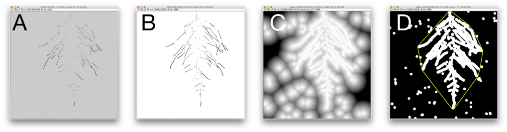
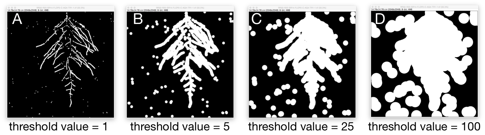
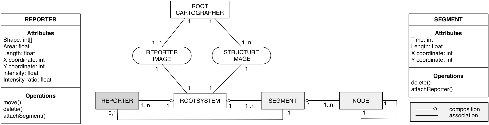
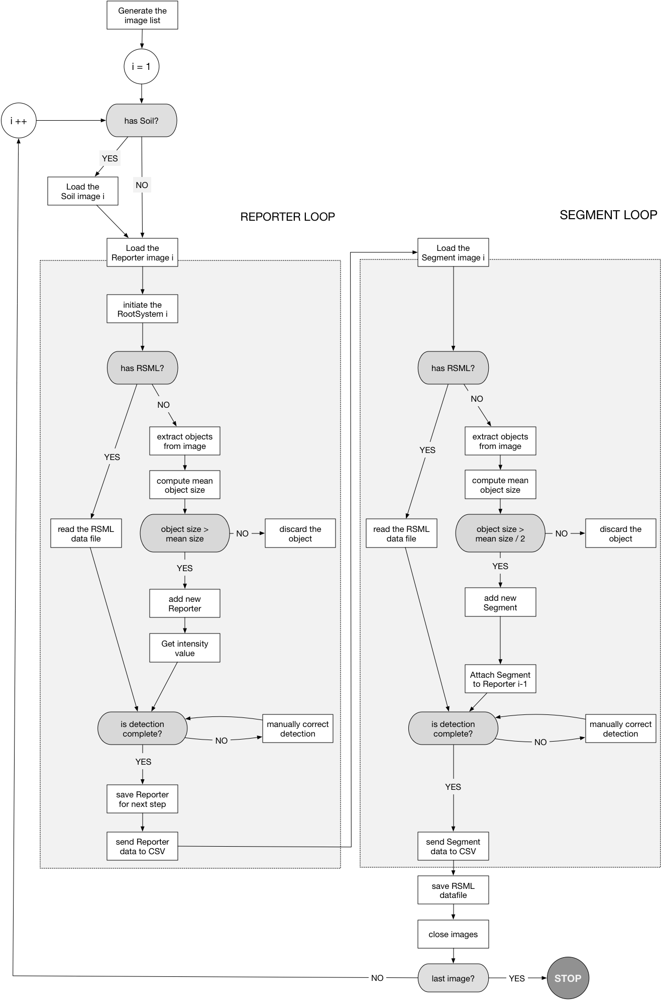
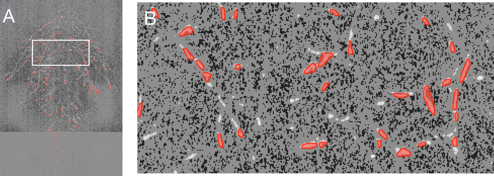
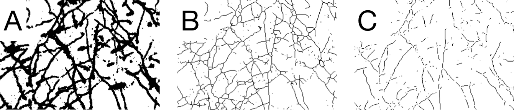
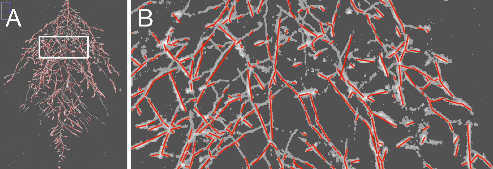
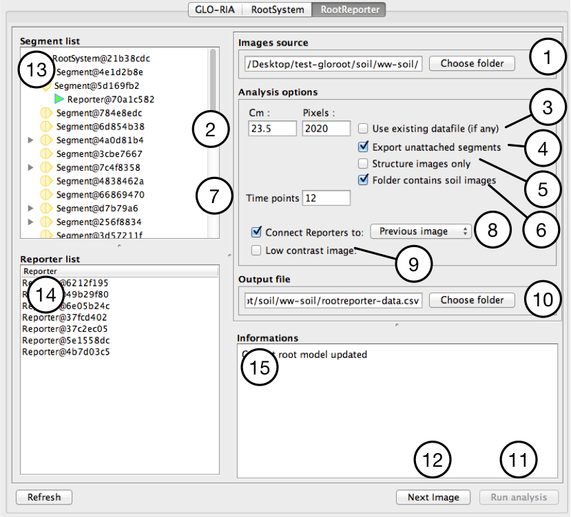
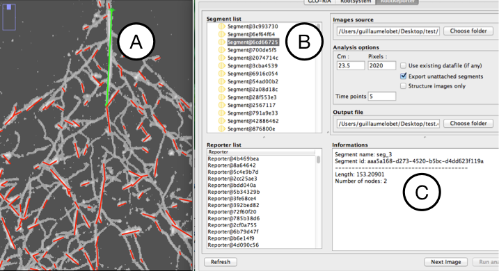

# GLO-Root Image Analysis Technical Report

----------------------------------------------------------

Guillaume Lobet1, Rubén Rellán-Álvarez2

1PhytoSYSTEMS - University of Liège

2Dinneny Lab - Carnegie Institution for Science

----------------------------------------------------------

Multidimensional mapping of root responses to soil environmental cues using a luminescence-based imaging syste- 2015
Rellán-Álvarez R, Lobet G, Hildner H, Pradier PL, Sebastian J, Yee MC, Yu G, La Rue T, Trontin C, Nieu R, Vogel J, Dinneny J *Submitted*

### General philosophy

GLO-Roots Image Analysis (GLO-RIA) is an ImageJ plugin intended for the analysis of root images generated using the **GLO-Roots imaging system**.

Two different type of analysis are available with the plugin: a local analysis of dual-reporter images (**RootReporter**) and a global analysis of the whole root system properties (**RootSystem**).

GLO-RIA is an open source tool hosted on GitHub: [https://github.com/rr-lab/glo_roots/](https://github.com/rr-lab/glo_roots/)

### Installing GLO-RIA

1. Download ImageJ (the plugin will not work on Fiji) and install it: [http://imagej.nih.gov/ij/](http://imagej.nih.gov/ij/)
2. Download the GLO_RIA.jar file [https://github.com/rr-lab/glo_roots/blob/master/gloria/GLO_RIA.jar](https://github.com/rr-lab/glo_roots/blob/master/gloria/GLO_RIA.jar)
3. Copy the GLO_RIA.jar file to :
	- /Program Files/ImageJ/plugins/ (Windows)
	- Applications/ImageJ/plugins/ (Mac)
4. Launch ImageJ
5. Go to *Plugins > GLO RIA*

### Disclaimer

This plugin is provided 'as is' and 'with all faults'. We makes no representations or warranties of any kind concerning the safety, suitability, lack of viruses, inaccuracies, typographical errors, or other harmful components of this plugin. There are inherent dangers in the use of any software, and you are solely responsible for determining whether this plugin is compatible with your equipment and other software installed on your equipment. You are also solely responsible for the protection of your equipment and backup of your data and we will not be liable for any damages you may suffer in connection with using, modifying, or distributing this plugin.

----------------------------------------------------------

## RootSystem

### Introduction

The aim of the RootSystem plugin is to retrieve global estimators from root system images. The plugin was designed to be used with image generated into the GLO-Root setup, but any root system image would work.

The plugin perform four types of analysis: local analysis, global analysis, Elliptic fourier Descriptor analysis, a directionality analysis and a shape analysis using pseudo-landmarks.

![RootSystem pipeline. A. Original image (contrast was increased for display purpose). B. Local detection of root particle. Each blue particle was detected with the algorithm. C. Global analysis of root system. Each red particle was detected with the algorithm. The blue shape represent the detected convex hull of the root system.  D. Elliptic fourier Descriptor (EFD) analysis.  The yellow line represents the shape computed from the computed EFD's. E. Directionality analysis. Each coloured line represent a detected direction in the root image. F. Shape analysis. The blue shape was detected automatically with a set of 20 pseudo landmarks\label(fig-rootsystem)](images/rootsystem_pipeline.png)

### Technical description

#### Thresholding

Images coming from the GLO-Root system generally have a low contrast between the objects and the background. In addition, the contrast does not seems to be constant, making difficult the application of a simple rule to threshold all the images. To overcome both the low contrast and the variability, the thresholding step is done as follow:

1. Normalise and equalise the image histogram.
2.  Get the mean value in the image.
3. Create a mask of the image using a threshold value of (mean * 2)

This method has been shown to be fairly good at thresholding the root particles from the background noise. It is used in all the algorithms described below.

#### Local analysis

The local analysis computes and measure all the root particles in the image. The detection is performed as follow:

1. Image is thresholded  (see above for details).
2. Particles larger than user defined minimum root size are measured.
3. I required, manual correction can be performed by the user.
4. For each particles, its size, position and orientation is sent to a CSV file.

The output CSV contains, for each image, data about every detected particle.

[Table Example of output for the local analysis]

| image       | length | angle  | x    | y   |
|:------------|:-------|:-------|:-----|:----|
| -           | cm     | °C     | cm   | cm  |
| image-1.tif | 0.47   | 1.73   | 8.1  | 0.5 |
| image-1.tif | 0.15   | -48.81 | 9.4  | 1.3 |
| image-1.tif | 0.22   | 58.39  | 10.0 | 1.6 |

#### Global analysis

The Global analysis computes metrics at the root system level. These includes the total root surface, the convex hull area, the depth and width of the root system.

The Global analysis works as follow:

1. Image is thresholded (see above for details).
2. The surface of all the detected particles is summed to get the total root area, red particles).
3. The root system convex hull is detected:
	1. An Euclidean Distance Map (EDM) is computed from the threshold image. In this EDM image, the value of each pixel is equal to its distance from the closest white particle (in this case, a root particle).
	2. Thresholding the EDM image will result in the merging of adjacent region of the image. High thresholding values will cause an important merging while low value will merge only directly adjacent particle. The Global analysis algorithm increases the thresholding value (starting from 0) in order to (i) have only one particule remaining in the image or (ii) reaching 20. The 20 threshold was chosen arbitrarily as the maximal acceptable distance between two root particles.
	3. The largest particle in the image (based on its area) is considered as the root system.
	4. The convex hull is computed for this object.
4. If asked by the user, a manual correction of the convex hull can be performed.
5. Data are exported to a CSV file.

The exported data included the area, depth and width of the root system, as well as its convex hull area and convex hull shape descriptors (roundness, solidity, circularity, center of mass).

[Table : Example of output for the Global analysis]

| image             | area   | convexhull | depth | width | circularity | ar    | round | solidity | feret  | feret_angle | massX | massY |
|:------------------|:-------|:-----------|:------|:------|:------------|:------|:------|:---------|:-------|:------------|:------|:------|
| -                 | cm2    | cm2        | cm    | cm    | -           | -     | -     | -        | cm     | °C          | cm    | cm    |
| image-1.tif,212.7 | 1.03   | 1.97       | 1.03  | 0.44  | 2.39        | 0.41  | 0.98  | 2.23     | 117.72 | 0.0         | 0.66  |       |
| image-2.tif,211.3 | 1.29   | 2.02       | 1.26  | 0.47  | 2.09        | 0.47  | 0.98  | 2.38     | 122.15 | 0.0         | 0.67  |       |
| image-3.tif       | 212.75 | 2.53       | 12.78 | 0.38  | 0.04        | 38.56 | 0.02  | 0.96     | 12.79  | 88.25       | 0.0   | 4.34  |

#### Elliptic fourier Descriptors analysis

This analysis computes a user defined number of Elliptic fourier Descriptors (EFD harmonics) of the root system convex hull. It works as follow:

1. The user choose the number of required harmonics
2. Image is thresholded  (see above for details).
3. The root system convex hull is detected (see above for more details on the detection).
4. If asked by the user, a manual correction of the convex hull can be performed.
5. The EFD harmonics are computed using the EFD plugin from Thomas Boudier and Ben Tupper [(available here)](http://imagejdocu.tudor.lu/doku.php?id=plugin:analysis:fourier_shape_analysis:start)
6. Data are send to a CSV file.

For each image, the CSV file contains one line per harmonic, containing its coordinates and coefficient.

[Table : Example of output for the EFD analysis]

| image       | index | ax      | ay      | bx      | by     | efd  |
|:------------|:------|:--------|:--------|:--------|:-------|:-----|
| image-1.tif | 1     | 1430.57 | 1194.0  | 0.0     | 0.0    | 2.95 |
| image-1     | 2     | -485.01 | -404.49 | -223.92 | 475.66 | 2.0  |
| image-1.tif | 3     | -212.77 | -9.19   | -259.99 | 175.17 | 0.93 |

#### Shape analysis analysis

This analysis automatically extract a user-defined number of pseudo-landmarks from the images. The landmarks are equidistance on the y axis. It works as follow:

1. The user choose the number of required landmarks
2. Image is thresholded  (see above for details).
3. The image is divided vertically in the number of required landmarks, and for each layer, the minimum and maximum x coordinates of the root system are extracted.
6. Data are send to a CSV file or a TPS file.

For each image, the CSV file contains one line per root system, containing its coordinates.

[Table : Example of output for the shape analysis]

| image       | coord_x_0 | coord_y_0   | ... | ... | coord_x_n | coord_y_n  |
|:------------|:------|:--------|:--------|:--------|:-------|:-----|
| image-1.tif | 0     | 126 | ...  | ...     | 345    |234 |
| ...     | 0     | 130 | ... | ... | 123 | 342  |
| image-1.tif | 0     | 97 | ...   | ... | 145 | 356 |

#### Directionality analysis

The aim fo the Directionality analysis is to retrieve the mean direction of the root particles in all or part of the image. The analysis works as follow:

1. The user choose the number of directions to investigates (typically 90, between -90° and 90° around the vertical)
2. The user choose the number of regions to investigate in the image. By default this is set to 1, to analyse the whole image at once.
3. The user choose the method to use
	1. Fourier analysis
	2. Local analysis (local anaylis is signficantly faster than fourier, give fourier around 20-30 s per image)
4. Image is thresholded  (see above for details).
5. Image is divided in the number of regions defined by the user.
6. For each region, the directionality histogram is computed using the [directionality plugin](https://github.com/fiji/Directionality/) by Jean-Yves Tinevez.
7. Data are saved to a CSV file

The CSV file contains, for each image region, one line by direction, with the position of the region, and the direction and the proportion of object detected in that direction.

[Table : example of output for the directionality analysis]

| image       | x   | y   | angle | count |
|:------------|:----|:----|:------|:------|
| -           | cm  | cm  | °C    | -     |
| image-1.tif | 2.9 | 4.4 | -90.0 | 2.93  |
| image-1.tif | 2.9 | 4.4 | -88.0 | 0.63  |
| image-1.tif | 2.9 | 4.4 | -86.0 | 0.78  |

### Using the plugin

The RootSystem plugin is fully automated and can perform the analysis without any user interaction. However, we recommend, at least, to review the images in order to manually correct the detections errors of the algorithms.

The number of options for the RootSystem plugin is limited, and mainly concerns the type of analysis the suer want to perform on the images.

1. **The source folder**, containing the images to analyse.
2. **Global analysis**. Checked if needed.
3. **Local analysis.**. Checked if needed.
4. **EFD analysis.**. Checked if needed. Number of harmonics needs to be specified.
5. **Directional analysis.**. Checked if needed. Number of orientation and image sections (in x and y) need to be specified.
6. **Manual correction**. Checked if needed. Recommended to ensure a good quality of the extracted data.
7. **Image scale.** Required to export the measurements in centimeters
8. **Minimum root size.** The expected minimum size (in pixels) for root objects in the image. Used to filter the small particles in the image.
9. **Black Roots** Checked if the roots are in black in the image. Unchecked by default, as the root objects are white in the images coming from the GLO-Root setup.
10. **Output parameters**. Choose the path for the output file.
11. **Run analysis**.

![RootSystem Interface. 1. Choose folder containing the images. 2. Global analysis. 3. Local analysis. 4. EFD analysis. Number of harmonics needs to be specified. 5. Directional analysis. Number of orientation and image sections (in x and y) need to be specified. 6. Manual correction. 7. Image scale. 8. Minimum root size. Used to filter the small particles in the image. 9. Are the roots in black in the image (false for images coming from the GLO-Root setup. 10. Choose the path for the output file. 11. Run the analysis.)](images/rs_interface.png)

----------------------------------------------------------

## RootReporter

### Introduction

The RootReporter plugin is intended for the analysis of images with channels containing different types of information. The plugin works with time series images, assuming that at each time point there are as many images as channels. RootReporter was initially build for (i) a structure channel (the root system); (ii) an expression channel (the gene of interest) and a soil property channel (such as soil moisture). The plugin can be used with only two channels (eg. root system + gene expression) and be extended to simultaneously analyze the expression of more than one gene or other soil physicochemical properties. The plusign enables analysis such as the evaluation of how the growth of the structure at a time *i* is linked to the expression of a gene of interest at a time *i-1*. As such, RootReporter transfers information between times points, to link structure and reporter's expression.

### Technical description

#### Plugin architecture

RootReporter is an object-oriented plugin, build on a RootSystem model. In short, this means that the plugin does not store the image objects as pixels values, but as conceptual objects, having their own behaviours and rules.

Each image-pair (the reporter and the structure image) is associated with a RootSystem object. This RootSystem is itself composed of both `segment` objects (extracted from the structure image) and `reporter` objects (extracted from the reporter image) (fig. \ref{fig-gloria-architecture}) . Each `segment` can then be explicitly associated with a `reporter`.

#### Folder structure

All images should be stored in a unique folder. Image should be name such as the folder´s structure is as follows:

- soil image 1
- reporter image 1
- structure image 1
- soil image 2
- reporter image 2
- structure image 2
...
- soil image i
- reporter image i
- structure image i

This order is important since is the one the RootReporter plugin will be looking for. Note that soil and reporter images are optional (see below).

#### Analysis pipeline

The pipeline used by RootReporter is described in the figure \ref{fig-gloria-pipeline}. Shortly, the plugin works as follow:

1. Retrieve the image list from the use defined folder
2. Create the RootSystem
3. Open the soil image and store it
4. Open the first reporter image
	1. Extract object from image
	2. Check the size of objects
	3. Create a Reporter object and add it to the RootSystem
	4. Manual correction
	5. Get local soil values
	6. Export to CSV
5. Open the first structure image
	1. Extract object from image
	2. Check the size of objects
	3. Create a Segment object and add it to the RootSystem
	4. Attach Segment to Reporter from previous image (if any)
	5. Manual correction
	6. Get local soil values
	7. Export to CSV
6. Save the data to an RSML file

#### Reporter objects

The detection and creation of reporter objects is performed using the following steps:

1. Enhance the contrast of the image using the ContrastEnhancer function. The aim for this step is to normalise the histogram between images and decrease the variations due to differences in the image acquisition. It is important to note that this is done solely for the object extraction. The intensity value is retrieve from the original, un-processed image.
2. Create a binary image using a threshold value of 140
3. Analyse the object in the images
4. Compute the mean object size
5. For each object, check wether the size is higher than the mean. If yes keep the object. This method was preferred to a static size threshold (e.g. size > 10 px) in order to be more generic.
6. For each validated object, create a Reporter object and add it to the RootSystem
7. Get the intensity value from the original, un-processed image
8. If needed, wet the local soil value from the Soil image

Each Reporter object has the following properties:

- position in the image : (x,y) coordinates of the center of mass of the object
- shape: defined as an irregular convex polygon
- area: the are of the object
- feret: maximum diameter of the object (aka caliper diameter)
- intensity: the mean pixel value inside the object in the Reporter image
- intensity ratio: the mean pixel value inside the object in the Reporter image / Segment image. This intensity ratio is important to normalize the luciferase activity signal of the reporter object. Since luciferase activity can be affected by many factors such as ATP or luciferin availability, this normalization ensures that the changes in intensity are due to changes in the expression value of the associated gene.

The RootReporter interface allows to review the Reporter detection and to move and delete detected reporters.

#### Segment objects

The detection and creation of root segments is performed using the following steps:

1. Create a binary image using a threshold  (see above for details).
2. Skeletonise the object.
3. Clean the skeleton by removing the connection points. Connection points are defined as the points having at least 3 black neighbours. This step allows to *split* the skeleton in small parts, making it easier to describe it with straight segments.
3. Analyse the object in the images
4. Compute the mean object size
5. For each object, check wether the size is higher than the mean/2. If yes keep the object. This method was preferred to a static size threshold (e.g. size > 10 px) in order to be more generic.
6. For each validated object, create a Segment object and add it to the RootSystem
7. For each Segment object, find the closest Reporter object. If the distance between them is smaller than two times the Reporter length, the Reporter is attached to the Segment.
8. If needed, wet the local soil value from the Soil image

Each Segment is represented by a polyline, composed of series of Nodes (2 by default).  Each Segment has the following properties:

- position: (x,y) coordinates of the first node.
- length: the total length fo the polyline
- orientation: the mean orientation of the polyline

#### Export to CSV

RootReporter automatically export the Reporter and Segment data to CSV files (one for each) at the end of the analysis:

- **Segment** : image, time_in_serie, segment_id, length, direction (deviation from the vertical, in °C), segment_x, segment_y, apex_id, intensity, intensity_ratio, diameter, apex_x, apex_y
- **Reporter**: image, time_in_serie, rep_id, intensity, intensity_ratio, diameter, apex_x, apex_y

#### RSML datafile

The Root System Markup Language is a modified XML data structure created for the storage of root system data. More information about the RSML can be found on the [project webpage](http://rootsystemml.github.io/).

Since RootReporter does not extract root architecture data *per se* (no topology, fragment of roots, ...), it can only read (and write) its own RSML datafile. It will not be able to import RSML data generated  with other tools. On the other hand, other tools should be able to read the RootReporter data.

### Using the plugin

#### The interface

The RootReporter plugin comes with a limited number of user inputs and options (fig. \ref{fig-rc-interface}):

1. **The source folder**, containing the images to analyse. This folder is expected to contains both the structure and reporter images.
2. **The scale**
3. **Use existing datafile (if any)**: If an RSML data file exist for this image, does RootReporter needs to use it. If  checked, no new detection well be made, the plugin will only charge the data contained into the RSML file.
4. **Export unattached segments**: If checked, export all the segment in the image, even the ones not attached to a Reporter object.
5. **Structure image only**: If checked, RootReporter consider that the source folder (see 1) contains only structure image. No Reporter detection will be made.
6. **Time points**: The number of time points formed by the time-series. By default, set the number of images in the source folder (see 1) / 2.
7. **Folder contains soil images**: If checked, the plugin will consider that the image folder contains soil images.
8. **Connect Reporters**: If checked, the plugin will try to match Segments with Reporters objects (based on their euclidean distance). User can choose to link Reporters from either the current time point or the previous one.
9. **Low contrast image**: For low contrast images, different algorithms, best suited for the detection of the Segment and Reporter objects, can be applied.
10. **Output file**: The path to the output CSV file.
11. **Run analysis**: Start the analysis. This will open the first Reporter image.
12. **Next image**: Open the next image in the folder.
13. **Segment List**: A list displaying all the Segments detected in the image. If the Segment has an attached Reporter, the Reporter will be displayed in the list as well.
14. **Reporter List**: A list displaying all the Reporter detected in the image.
15. **Informations**: A text panel displaying the information relative to the selected object in the image.

#### Correcting a tracing

Both the Segment and the Reporter detection can be manually corrected by the user. RootReporter creates an additional layer on top of the analysed image and use it to display the different objects it has in memory. This allows the user to modify the detection without changing the original image.

1. **Selecting an object**. To select and object, either click on it in the image, or in the Segment / Reporter list. The selected object will be highlighted in green in the image. Information about the selected object will be displayed in the Information text box.
2. **Moving an object**.
	1. *Reporter*: to move a Reporter object, just click on it and drag it around
	2. *Segment*: to move a segment, click it to selected it. Once selected, the Nodes composing the Segment will appear. Each Node can be drag and drop in the image to modify the Segment's shape.
3. **Modifying a Segment**: Select the Segment to modify in order to display its node. Press the *Alt* key and click inside the Segment to create additional Nodes.
4. **Deleting an object**: to delete an object in the image, press the *Ctrl* key and click on the object. The object does not need to be selected first.

